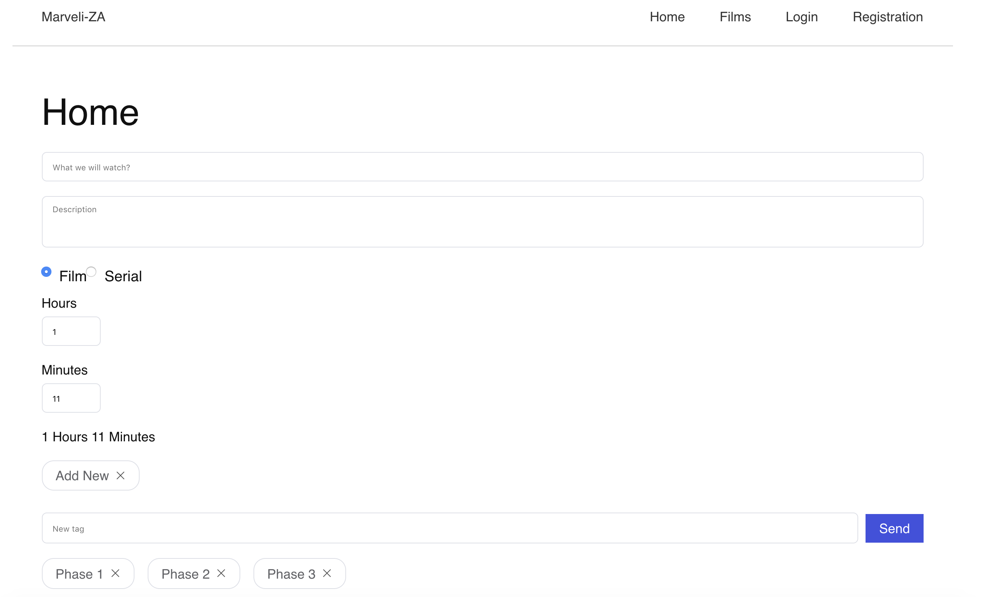

# marveli-za

> A Vue.js project. Film library of Marvel 

## Build Setup

``` bash
# install dependencies
npm install

# serve with hot reload at localhost:8080
npm run dev

# build for production with minification
npm run build

```
c
CI | Build status | basic config file | 
:--- | :--- | :--- |
GitLab | [](https://gitlab.com/zabolennyi/marveli-za/commits/master) | [.gitlab-ci.yml](.gitlab-ci.yml) |
Travis | [](https://travis-ci.org/zabolennyi/marveli-za) | [.travis.yml](.travis.yml) | 
Circle | [](https://circleci.com/gh/zabolennyi/marveli-za) | [circle.yml](circle.yml) |

## Demo

### Homepage


### Add film


### List of films/series already wathced/to watch


